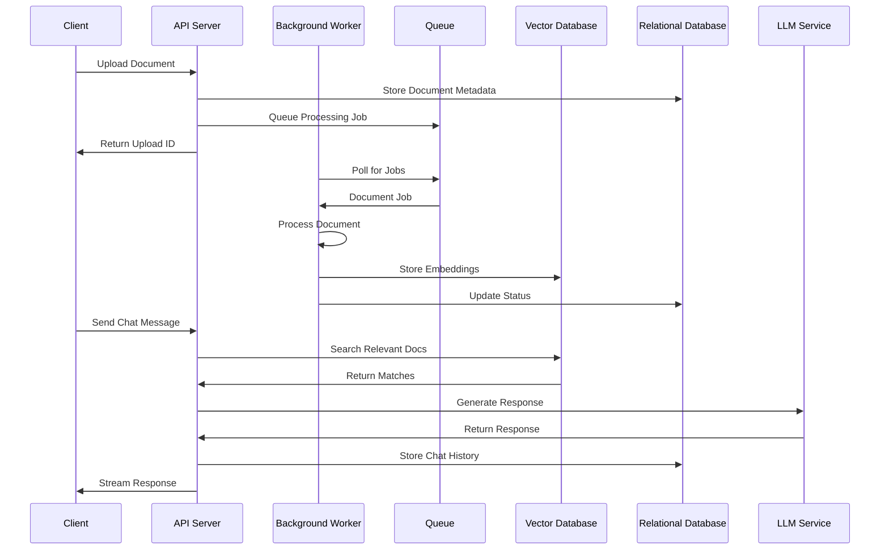

Author: 何宏健

# RAG Chatbot

A Retrieval-Augmented Generation (RAG) chatbot that allows users to upload documents and chat with an AI that understands their content. Built with FastAPI, Celery, and React.

## Key Features

- 📑 **Document Management**
  - Upload multiple document formats (PDF, DOC, TXT)
  - Real-time processing status updates
  - Document list with status tracking
  - Delete/manage uploaded documents

- 💬 **Chat Interface**
  - Chat session management
  - Complete chat history in left sidebar
  - Start new chat sessions
  - Continue existing conversations


## Tech Stack

- **Backend**: FastAPI, Python 3.9+
- **Frontend**: TailwindCSS
- **Database**: PostgreSQL
- **Vector Store**: Qdrant
- **Message Queue**: Redis, Celery
- **Document Processing**: PyMuPDF, EasyOCR, AnyParser
- **Containerization**: Docker

## Project Structure

```
rag-chatbot/
├── frontend-backend/                 # FastAPI full-stack application
│   ├── app/
    │   │   ├── api/            # API routes and endpoints
│   │   │   ├── core/           # Core configuration
│   │   │   ├── crud/           # Crud operation
│   │   │   ├── db/             # Database definition and models
│   │   │   ├── schemas/        # Pydantic schemas
│   │   │   ├── worker/         # Background task worker
│   │   │   ├── static/         # Javascript code
│   │   │   ├── templates/      # Jinja2 frontend template
│   │   │   └── services/       # Business logic
│   └── docker/                 # Docker configuration files
```



## Setup and Installation

1. Clone the repository:
```bash
git clone https://github.com/jordenheig/ai-chatbot
cd ai-chatbot
```

2. Start with Docker (recommended):
```bash
bash run.sh
```


## Special note

Due to network reason, the code in this repository is only tested up to downloading the huggingface model. A proper resolution of this
network issue requires a complete dig-in of the configuration of my current network setup, for which i just leave since there's limited time for this work.


